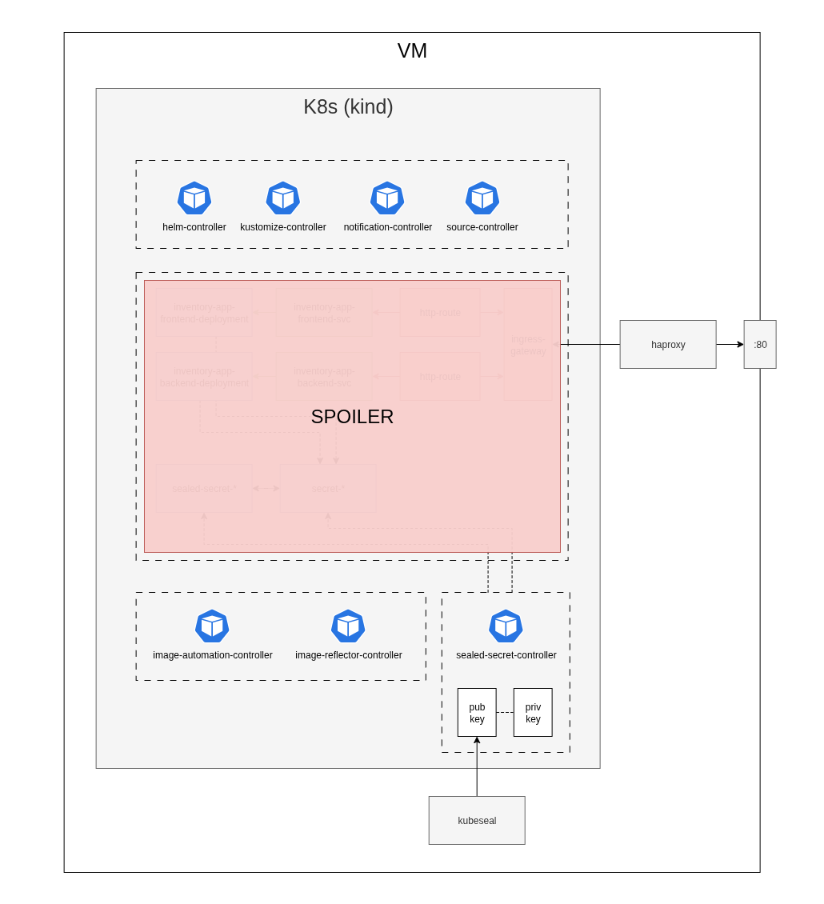

# Pulpocon 2025 | Taller - Devops: Despliegue Continuo en Kubernetes con GitOps y FluxCD

## Preparación del taller
Para evitar los problemas del directo y no saturar la red te sugerimos preparar el entorno antes del viernes. 

## Te dejamos aquí los pasos:

1. Crea una cuenta en [GitHub](https://github.com/) si no la tienes.
2. Crea una cuenta en [DockerHub](https://hub.docker.com/) si no la tienes.
3. Instala [VirtualBox](https://www.virtualbox.org/wiki/Downloads) en tu sistema preferido.
4. Instala [Vagrant](https://developer.hashicorp.com/vagrant/install) en tu sistema preferido.
5. Clona este repo:
    ```
    git clone https://github.com/Gradiant/pulpocon2025-taller-gitops-fluxcd.git
    ```
6. Colócate en el directorio del repo y:
    ```
    cd ./vm
    vagrant up
    ```
    > Este proceso puede tardar un buen rato, ten paciencia.
    
7. Comprueba que todo haya ido bien
    ```
    ssh vagrant@192.168.56.210
    # password: vagrant

    kubectl get pods -A
    ```
    > Si ves todo en estado `Running` perfecto, ya estás listo para el viernes!

## ¿Y ahora?
Ahora ya tienes una máquina virtual con todo lo necesario en tu ordenador.

Puedes apagarla (hasta el día del taller) con:
```
# desde ./vm
vagrant halt
```
volver a encenderla cuando quieras con:
```
# desde ./vm
vagrant up
```
o borrarla (despúes del taller) con:
```
# desde ./vm
vagrant destroy
```

> También puedes usar la interfaz gráfica de VirtualBox para interactuar con ella.


## Te puede la curiosidad
Si eres muy curioso, te dejamos un diagrama con el entorno que hemos montado en tu máquina para el viernes:




## Se me ha complicado esto...
Si no has sido capaz de llegar hasta el punto 7, no te preocupes, lo dejaremos listo entre todos el viernes al comenzar el taller.

## Problemas con módulos del kernel
Si has tenido algún problema similar a:

```
No usable default provider could be found for your system.
 
Vagrant relies on interactions with 3rd party systems, known as
"providers", to provide Vagrant with resources to run development
environments. Examples are VirtualBox, VMware, Hyper-V.
 
The easiest solution to this message is to install VirtualBox, which
is available for free on all major platforms.
 
If you believe you already have a provider available, make sure it
is properly installed and configured. You can see more details about
why a particular provider isn't working by forcing usage with
`vagrant up --provider=PROVIDER`, which should give you a more specific
error message for that particular provider.
```

prueba con

```bash
# Requisitos para compilar el módulo
sudo apt update
sudo apt install -y build-essential dkms linux-headers-$(uname -r)

# (Si no lo tienes ya) Repo oficial de Oracle
. /etc/os-release; echo "deb [arch=amd64 signed-by=/usr/share/keyrings/oracle-vbox.gpg] https://download.virtualbox.org/virtualbox/debian $VERSION_CODENAME contrib" | sudo tee /etc/apt/sources.list.d/virtualbox.list
wget -qO- https://www.virtualbox.org/download/oracle_vbox_2016.asc | sudo gpg --dearmor -o /usr/share/keyrings/oracle-vbox.gpg
sudo apt update

# VirtualBox 7.x
sudo apt install -y virtualbox-7.0

# Compilar/cargar módulos
sudo /sbin/vboxconfig
sudo modprobe vboxdrv
VBoxManage --version
```